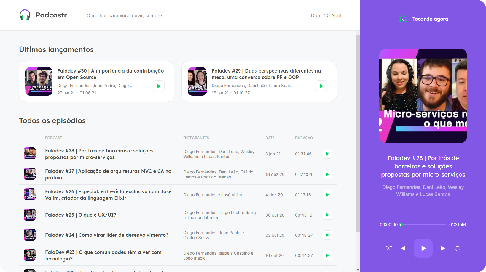

## 💻 Projeto

Projeto desenvolvido durante a 5ª edição do Next Level Week da Rocketseat.

## 🧭 Tecnologias

O projeto foi desenvolvido com as teconlogias:

- [Typescript](https://www.typescriptlang.org/)
- [ReactJS](https://reactjs.org/)
- [Next.js](https://nextjs.org/)

<h2>
  📌 Executando o projeto
</h2>

### Clone the repository to have a copy of the code on your machine

```bash
$ git clone https://github.com/thiagotnon/NLW5_Podcastr && cd NLW5_Podcastr
```

### Instale as dependências

```bash
$ yarn install
```

### Execute o backend

```bash
$ yarn server
```

### Execute o projeto

```bash
$ yarn dev
```

O aplicativo será executado no endereço **http://localhost:3000**

<h4 align=center>Feito com ❤️ por <a href="https://www.linkedin.com/in/thiago-nascimento-2540a0a3/">Thiago N.</a></h4>
